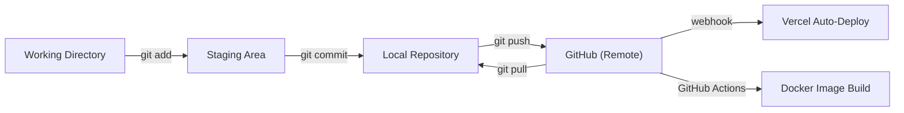
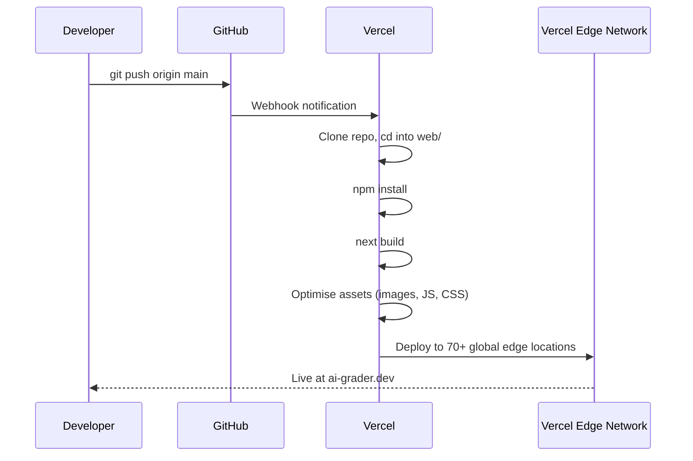
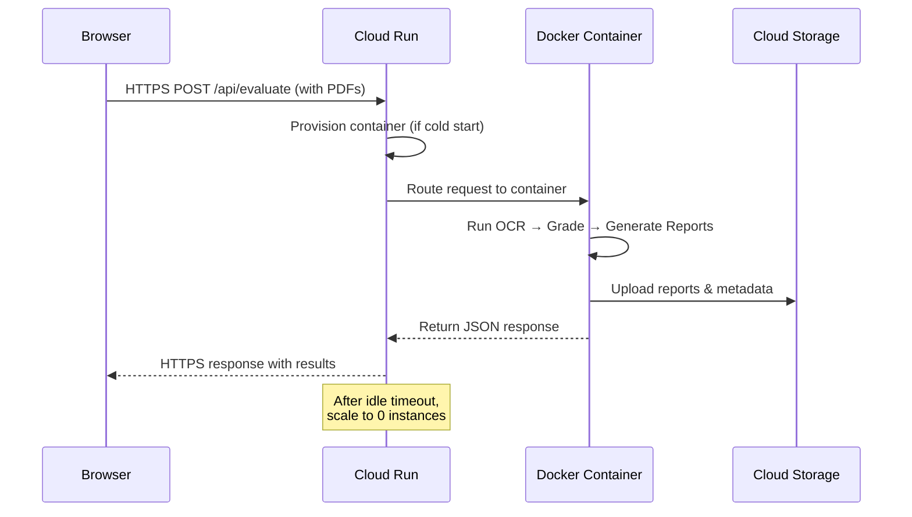
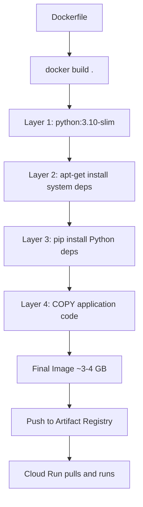
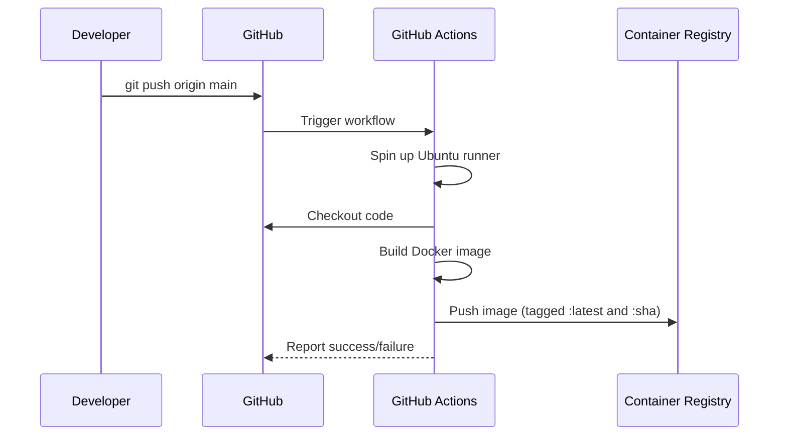
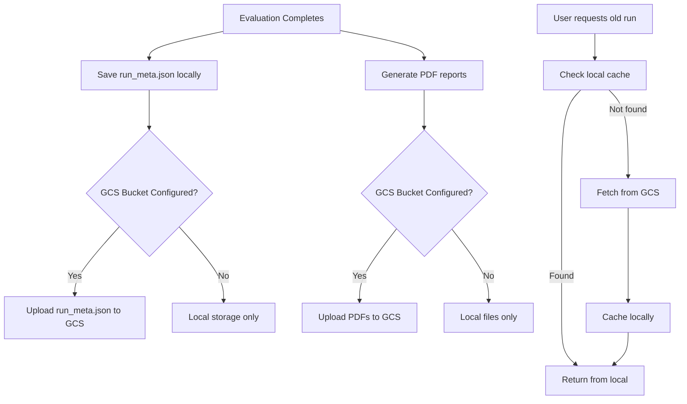
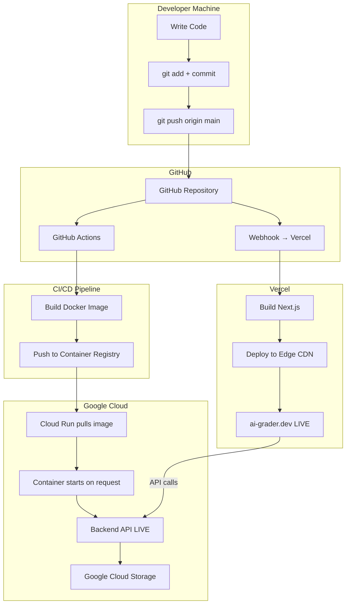

# Deployment Architecture — Automated Subjective Grader

> **Comprehensive guide** covering every tool, library, and technology used in deploying the project live — from Git version control to cloud hosting.

---

## Table of Contents

1. [High-Level Architecture](#1-high-level-architecture)
2. [Version Control — Git & GitHub](#2-version-control--git--github)
3. [Frontend — Next.js on Vercel](#3-frontend--nextjs-on-vercel)
4. [Backend — FastAPI on Google Cloud Run](#4-backend--fastapi-on-google-cloud-run)
5. [Containerisation — Docker](#5-containerisation--docker)
6. [CI/CD — GitHub Actions](#6-cicd--github-actions)
7. [Runtime Libraries & Frameworks (Backend)](#7-runtime-libraries--frameworks-backend)
8. [Runtime Libraries & Frameworks (Frontend)](#8-runtime-libraries--frameworks-frontend)
9. [Environment Variables & Secrets](#9-environment-variables--secrets)
10. [Cloud Storage — Google Cloud Storage (GCS)](#10-cloud-storage--google-cloud-storage-gcs)
11. [The Complete HTTP Request Lifecycle](#11-the-complete-http-request-lifecycle)
12. [SEO & Web Standards Infrastructure](#12-seo--web-standards-infrastructure)
13. [Domain & DNS Setup](#13-domain--dns-setup)
14. [Monitoring & Health Checks](#14-monitoring--health-checks)
15. [Security Practices](#15-security-practices)

---

## 1. High-Level Architecture

The project follows a **split deployment model** — the user-facing website and the heavy computational backend are deployed on two different cloud platforms, each chosen for its strengths.

```
┌──────────────────────────────────────────────────────────────────────┐
│                        USER'S BROWSER                              │
│  Opens https://ai-grader.dev  →  Uploads PDFs  →  Gets Results     │
└──────────────────┬───────────────────────────────┬───────────────────┘
                   │                               │
                   │  HTML/CSS/JS                   │  PDF uploads &
                   │  (Server-Side Rendered)        │  API requests
                   ▼                               ▼
┌──────────────────────────────┐  ┌─────────────────────────────────────┐
│        VERCEL (Frontend)     │  │    GOOGLE CLOUD RUN (Backend)       │
│                              │  │                                     │
│  • Next.js 15 (App Router)   │  │  • FastAPI 0.135                    │
│  • React 19                  │  │  • Uvicorn ASGI server              │
│  • TypeScript 6              │  │  • Python 3.10                      │
│  • Server-Side Rendering     │  │  • Docker container                 │
│  • Edge Middleware            │  │  • 4 GB RAM, 2 vCPU                │
│  • Automatic HTTPS           │  │  • Auto-scaling (0→1 instances)     │
│  • Global CDN (Edge Network) │  │  • Automatic HTTPS                  │
│                              │  │  • Region: asia-south1 (Mumbai)     │
│  Root Directory: web/        │  │                                     │
│  Domain: ai-grader.dev       │  │  URL: *.asia-south1.run.app         │
└──────────────────────────────┘  └────────────────┬────────────────────┘
                                                   │
                                                   ▼
                                  ┌─────────────────────────────────────┐
                                  │   GOOGLE CLOUD STORAGE (GCS)        │
                                  │                                     │
                                  │  • Stores completed run metadata    │
                                  │  • Stores generated PDF reports     │
                                  │  • Durable across instance restarts │
                                  │  • Bucket: configured via env var   │
                                  └─────────────────────────────────────┘
```

### Why This Split?

| Concern | Vercel (Frontend) | Cloud Run (Backend) |
|---|---|---|
| **Workload type** | Lightweight SSR pages | Heavy OCR, ML inference, PDF generation |
| **Execution time** | Milliseconds | Minutes (up to 1 hour timeout) |
| **File uploads** | Limited by serverless proxy | Direct upload, no size limits |
| **Scaling** | Global edge, instant | Container-based, configurable |
| **Cost** | Free tier generous | Pay-per-use (billed per second of compute) |

---

## 2. Version Control — Git & GitHub

### 2.1 What is Git?

**Git** is a *distributed version control system*. It tracks every change made to every file in your project. Think of it as an "infinite undo system" that also lets multiple people work on the same codebase without overwriting each other.

Key concepts:

| Concept | What It Does |
|---|---|
| **Repository (Repo)** | The project folder, along with the entire history of all changes ever made. The `.git/` hidden directory stores this history. |
| **Commit** | A snapshot of the project at a specific point in time. Each commit has a unique SHA hash (e.g., `a1b2c3d`), a message, an author, and a timestamp. |
| **Branch** | An independent line of development. The default branch is `main`. Feature branches (e.g., `feature/add-ocr`) let you develop without affecting the stable `main` code. |
| **Staging Area (Index)** | A holding area where you select which changes to include in the next commit. `git add` moves changes here. |
| **Remote** | A copy of the repository hosted on a server (GitHub). Named `origin` by convention. |

### 2.2 Core Git Commands Used in This Project

```powershell
# ──────────────────────────────────────
# INITIAL SETUP
# ──────────────────────────────────────

git init
# Creates a new Git repository in the current folder.
# Generates the hidden .git/ directory that stores all version history.

git remote add origin https://github.com/vermayuvraj/auto-subjective-grader.git
# Links this local repository to the GitHub remote.
# "origin" is the conventional name for the primary remote.

# ──────────────────────────────────────
# DAY-TO-DAY WORKFLOW
# ──────────────────────────────────────

git status
# Shows which files are modified, staged, or untracked.

git add .
# Stages ALL changed and new files for the next commit.
# The "." means "everything in the current directory and below".

git add backend_api/main.py
# Stages a specific file only.

git commit -m "Add CORS middleware to backend API"
# Creates a permanent snapshot of all staged changes.
# The -m flag provides the commit message inline.
# Each commit is identified by a unique SHA hash.

git push origin main
# Uploads local commits from the "main" branch to GitHub.
# This is what makes your code available in the cloud.
# Vercel auto-deploys when it detects a push to main.

git pull origin main
# Downloads the latest commits from GitHub and merges them
# into your local branch. Used when collaborating or when
# the remote has changes you don't have locally.

git branch feature/new-ocr-engine
# Creates a new branch for isolated development.

git checkout feature/new-ocr-engine
# Switches to the new branch. All commits go here now.

git merge feature/new-ocr-engine
# Merges the feature branch back into the current branch.
# Combines the commit histories together.
# If the same lines were changed in both branches, Git
# asks you to resolve the "merge conflict" manually.

git log --oneline -10
# Shows the last 10 commits in a compact format.
```

### 2.3 What is GitHub?

**GitHub** is a cloud platform that hosts Git repositories and adds collaboration features on top of Git:

| Feature | Purpose in This Project |
|---|---|
| **Remote Repository** | Central storage for the codebase at `github.com/vermayuvraj/auto-subjective-grader` |
| **Pull Requests (PRs)** | A proposed set of changes. Team members review the code diff, discuss, and approve before merging into `main`. |
| **GitHub Actions** | CI/CD automation — runs workflows (build Docker image, run tests) whenever code is pushed. |
| **Secrets** | Encrypted environment variables (API keys, passwords) stored in the repo settings, injected at build time. |
| **CODEOWNERS** | The file `.github/CODEOWNERS` contains `* @vermayuvraj`, meaning all pull requests automatically request review from `@vermayuvraj`. |
| **Issues** | Bug tracking and feature request management. |
| **Branches** | GitHub UI shows all branches, their status, and how far ahead/behind they are from `main`. |

### 2.4 The `.gitignore` File

This file tells Git which files and directories to **never track**:

```text
.venv/              # Python virtual environment (large, machine-specific)
__pycache__/        # Compiled Python bytecode
*.py[cod]           # Python compiled files

.env                # Local secrets — NEVER committed
.env.local          # Local frontend secrets
.env.production     # Production secrets
web/.env.local      # Frontend local env
web/.env.production # Frontend production env

logs/               # Runtime log files
results/            # Generated evaluation results
data/               # Input data files
persistent_data/    # Docker volume data

web/node_modules/   # npm packages (reinstalled from package.json)
web/.next/          # Next.js build output

.DS_Store           # macOS filesystem metadata
Thumbs.db           # Windows thumbnail cache
```

> [!IMPORTANT]
> **Secrets (API keys, passwords) must NEVER be committed to Git.** They are managed through environment variables on Vercel and Cloud Run, never in the source code.

### 2.5 Git Workflow Diagram



---

## 3. Frontend — Next.js on Vercel

### 3.1 Next.js (v15)

**Next.js** is a React-based web framework created by Vercel. It adds server-side rendering, file-based routing, and production optimisations on top of React.

| Feature | How It's Used |
|---|---|
| **App Router** | The `web/app/` directory defines routes. `app/page.tsx` = home page, `app/evaluate/page.tsx` = evaluate page, `app/team/page.tsx` = team page. |
| **Server-Side Rendering (SSR)** | Pages are rendered on the server first, then sent as HTML to the browser. This improves SEO and initial load speed. |
| **Server Components** | Components that run only on the server — they can fetch data from the backend API directly without exposing API keys to the browser. |
| **API Routes** | `app/api/[...path]/route.ts` acts as a catch-all proxy — forwarding certain API requests from the frontend to the backend. |
| **Middleware** | `middleware.ts` runs at the edge (before any page renders) to handle redirects, rewrites (e.g., routing `docs.ai-grader.dev` to the documentation page). |
| **Static Generation** | Pages that don't change often (team, documentation) can be pre-built at deploy time for maximum speed. |
| **TypeScript** | All frontend code is written in TypeScript (`.ts`/`.tsx`), providing compile-time type checking. |

### 3.2 React (v19)

**React** is the UI library that powers all the interactive components. It uses a component-based architecture where each piece of the UI (header, evaluation form, results table) is an independent, reusable component.

### 3.3 TypeScript (v6)

**TypeScript** adds static types to JavaScript. Instead of discovering bugs at runtime, the compiler catches them during development:

```typescript
// TypeScript catches this error at compile time, not in production:
function greet(name: string): string {
  return `Hello, ${name}`;
}
greet(42); // Error: Argument of type 'number' is not assignable to parameter of type 'string'
```

### 3.4 Vercel (Hosting Platform)

**Vercel** is a cloud platform optimised for frontend frameworks, especially Next.js (they created it).

#### How Vercel Deployment Works



#### Key Vercel Features Used

| Feature | What It Does |
|---|---|
| **Git Integration** | Automatically deploys when code is pushed to GitHub. Each push to `main` triggers a production deployment. |
| **Preview Deployments** | Every pull request gets its own unique URL to test changes before merging. |
| **Edge Network (CDN)** | Static assets are cached on 70+ global edge locations for minimal latency. |
| **Automatic HTTPS** | SSL/TLS certificates are provisioned and renewed automatically. |
| **Environment Variables** | Set in the Vercel dashboard — `NEXT_PUBLIC_API_BASE_URL`, `BACKEND_API_BASE_URL`, `GOOGLE_SITE_VERIFICATION`. |
| **Serverless Functions** | API routes (`app/api/`) run as serverless functions — they spin up on demand and scale automatically. |
| **Root Directory** | Configured to `web/` — Vercel only builds and deploys the frontend subdirectory. |
| **Framework Detection** | Vercel auto-detects Next.js and applies optimal build settings. |

#### Vercel Configuration

The `.vercel/project.json` links the local project to the Vercel project:

```json
{
  "projectId": "prj_KCQxWr5hDGav1GMNXmyrD87PbbXQ",
  "orgId": "team_POVyyKbCPohVoRsNFCvhKAxH",
  "projectName": "web"
}
```

### 3.5 The Frontend API Client (`lib/api.ts`)

This file resolves which backend URL to use:

```typescript
// Production: hardcoded Cloud Run URL
const CLOUD_RUN_API_BASE_URL =
  "https://auto-subjective-grader-api-217944702445.asia-south1.run.app";

// Development: use local backend (localhost:8001)
// Production: use Cloud Run URL
const SERVER_API_BASE_URL =
  process.env.NODE_ENV === "development"
    ? process.env.BACKEND_API_BASE_URL || "http://127.0.0.1:8001"
    : CLOUD_RUN_API_BASE_URL;
```

**Why two base URLs?**
- `SERVER_API_BASE_URL`: Used by server components (runs on Vercel's servers, makes server-to-server requests to Cloud Run)
- `BROWSER_API_BASE_URL`: Used by client components (runs in the user's browser, makes cross-origin requests to Cloud Run)

---

## 4. Backend — FastAPI on Google Cloud Run

### 4.1 FastAPI

**FastAPI** is a modern Python web framework for building APIs. It is the backbone of the backend service.

| Feature | How It's Used |
|---|---|
| **Automatic API docs** | FastAPI auto-generates interactive API documentation at `/docs` (Swagger UI) |
| **Type validation** | Uses Python type hints for automatic request validation |
| **Async support** | Can handle concurrent requests efficiently |
| **File uploads** | `UploadFile` class handles multipart PDF uploads |

The backend application is defined in `backend_api/main.py`:

```python
app = FastAPI(
    title="Automated Subjective Grader API",
    version="2.0.0",
    description="FastAPI backend for the product-grade answer sheet evaluation website.",
)
```

#### Key API Endpoints

| Method | Endpoint | Purpose |
|---|---|---|
| `GET` | `/api/health` | Health check — returns `{"status": "ok"}` |
| `GET` | `/api/runtime-config` | Shows which services (Azure, Gemini, GCS) are configured |
| `GET` | `/api/team` | Returns team member data |
| `GET` | `/api/documentation` | Returns README.md content for the docs page |
| `GET` | `/api/resources` | Returns learning resource links |
| `GET` | `/api/jobs` | Lists all evaluation runs |
| `GET` | `/api/jobs/{run_id}` | Gets details of a specific run |
| `POST` | `/api/jobs` | Creates a new async evaluation job |
| `POST` | `/api/evaluate` | Runs a synchronous evaluation (used in production) |
| `GET` | `/api/runs/{run_id}/reports/{name}` | Downloads a generated PDF report |

### 4.2 Uvicorn

**Uvicorn** is an ASGI (Asynchronous Server Gateway Interface) server. It is the actual process that listens for HTTP requests and passes them to FastAPI.

```bash
# This is what runs inside the Docker container:
python -m uvicorn backend_api.main:app \
  --host 0.0.0.0 \       # Listen on all network interfaces
  --port 8001 \           # Listen on port 8001
  --workers 1             # Run a single worker process
```

Think of it this way:
- **Uvicorn** = the waiter who receives orders (HTTP requests) from customers
- **FastAPI** = the kitchen that processes the orders and sends back responses

### 4.3 CORS Middleware

**CORS (Cross-Origin Resource Sharing)** is a security mechanism built into web browsers. When the frontend at `ai-grader.dev` makes a request to the backend at `*.run.app`, the browser blocks it unless the backend explicitly allows it.

```python
app.add_middleware(
    CORSMiddleware,
    allow_origins=SETTINGS.allowed_origins,  # ["*"] or specific domains
    allow_credentials=False,
    allow_methods=["*"],     # GET, POST, PUT, DELETE, etc.
    allow_headers=["*"],     # Content-Type, Authorization, etc.
)
```

The `ALLOWED_ORIGINS` environment variable controls which frontend domains can call the backend.

### 4.4 Google Cloud Run

**Google Cloud Run** is a fully managed serverless container platform. It takes a Docker container and runs it as an HTTPS service.

#### How Cloud Run Works



#### Cloud Run Configuration

```powershell
gcloud run deploy auto-subjective-grader-api `
  --source .                    # Build from Dockerfile in current directory
  --project YOUR_PROJECT_ID     # GCP project
  --region asia-south1          # Mumbai region (closest to India)
  --allow-unauthenticated       # Public access (no auth required)
  --memory 4Gi                  # 4 GB RAM (needed for ML models)
  --cpu 2                       # 2 vCPUs
  --timeout 3600                # 1 hour max request timeout
  --concurrency 1               # 1 request at a time per instance
  --max-instances 1             # Maximum 1 container instance
  --port 8001                   # Container listens on port 8001
```

| Parameter | Why This Value |
|---|---|
| `--memory 4Gi` | OCR models (EasyOCR, SBERT, pix2tex) need significant RAM |
| `--cpu 2` | ML inference benefits from multiple cores |
| `--timeout 3600` | A full evaluation batch can take several minutes |
| `--concurrency 1` | The pipeline uses shared in-memory state; one request at a time prevents conflicts |
| `--max-instances 1` | Cost control — prevents runaway scaling |
| `--region asia-south1` | Mumbai data centre — lowest latency for Indian users |

#### Google Cloud Services Used

| Service | Purpose |
|---|---|
| **Cloud Run** | Runs the Docker container as a managed HTTPS service |
| **Cloud Build** | Builds the Docker image from source when deploying with `--source .` |
| **Artifact Registry** | Stores the built Docker images |
| **Cloud Storage (GCS)** | Stores durable run metadata and PDF reports (survives container restarts) |

#### Google Cloud APIs That Must Be Enabled

```
run.googleapis.com              # Cloud Run itself
cloudbuild.googleapis.com       # Building Docker images
artifactregistry.googleapis.com # Storing Docker images
storage.googleapis.com          # Cloud Storage for run artifacts
```

---

## 5. Containerisation — Docker

### 5.1 What is Docker?

**Docker** packages an application and all its dependencies into a standardised unit called a **container**. A container is like a lightweight virtual machine — it includes the OS, the Python interpreter, all libraries, the application code, and system utilities, all in one portable image.

**Why Docker?**
- **"Works on my machine" problem solved**: The exact same container runs on your laptop, in CI, and in production.
- **Reproducible builds**: Pin library versions, OS packages, and configuration.
- **Isolation**: The application doesn't interfere with or depend on the host system.

### 5.2 The Dockerfile Explained

The `Dockerfile` is the recipe for building the container image:

```dockerfile
# ─── BASE IMAGE ─────────────────────────────────────────
FROM python:3.10-slim
# Start from the official Python 3.10 image (Debian-based, minimal).
# "slim" variant excludes dev tools to keep the image small.

# ─── ENVIRONMENT VARIABLES ──────────────────────────────
ENV PYTHONDONTWRITEBYTECODE=1 \
    # Don't create .pyc bytecode files (saves disk space)
    PYTHONUNBUFFERED=1 \
    # Don't buffer stdout/stderr (logs appear immediately)
    PIP_NO_CACHE_DIR=1 \
    # Don't cache pip downloads (saves disk space)
    PIP_PREFER_BINARY=1 \
    # Prefer pre-built wheels over building from source
    EASYOCR_USE_GPU=false \
    # Disable GPU (Cloud Run doesn't have GPUs)
    API_RUNS_ROOT=/app/persistent_data/api_runs
    # Default path for storing evaluation artifacts

# ─── WORKING DIRECTORY ──────────────────────────────────
WORKDIR /app
# All subsequent commands run from /app inside the container.

# ─── SYSTEM DEPENDENCIES ────────────────────────────────
RUN apt-get update && apt-get install -y --no-install-recommends \
    build-essential \      # C compiler (needed for some Python packages)
    git \                  # Git (needed by some pip packages)
    libglib2.0-0 \         # GLib library (needed by OpenCV)
    libgl1 \               # OpenGL (needed by OpenCV)
    libgomp1 \             # OpenMP (parallel computing for numpy/torch)
    libsm6 \               # X11 Session Management (OpenCV dependency)
    libxext6 \             # X11 Extensions (OpenCV dependency)
    libxrender1 \          # X11 Rendering (OpenCV dependency)
    poppler-utils \        # pdf2image uses this to convert PDF pages to images
    && rm -rf /var/lib/apt/lists/*
    # Clean up apt cache to reduce image size

# ─── PYTHON DEPENDENCIES ────────────────────────────────
COPY README.md ./README.md
COPY rubric.json ./rubric.json
COPY requirements.backend.txt ./requirements.backend.txt

RUN python -m pip install --upgrade "pip<24.1" setuptools wheel && \
    pip install --prefer-binary -r requirements.backend.txt
# Install all Python dependencies from requirements.backend.txt.
# Dependencies are installed BEFORE copying source code — this way,
# Docker caches this layer and only re-installs when requirements change.

# ─── APPLICATION CODE ────────────────────────────────────
COPY backend_api ./backend_api
COPY src ./src
COPY start-backend.sh ./start-backend.sh

# ─── RUNTIME SETUP ────────────────────────────────────
RUN mkdir -p /app/persistent_data/api_runs
RUN chmod +x /app/start-backend.sh

EXPOSE 8001
# Document that the container listens on port 8001.

CMD ["/app/start-backend.sh"]
# The default command when the container starts.
```

### 5.3 The `.dockerignore` File

Just like `.gitignore` tells Git what to skip, `.dockerignore` tells Docker what NOT to include in the image:

```text
.venv                   # Local Python environment (we install fresh)
web/node_modules        # Frontend packages (not needed in backend container)
web/.next               # Frontend build output
logs                    # Runtime logs
results                 # Generated results
data                    # Input data
__pycache__             # Python cache
.git                    # Git history (unnecessary in production)
.env                    # Secrets (injected via environment, not baked into image)
```

### 5.4 Docker Compose (`docker-compose.backend.yml`)

For local testing and alternative deployments (e.g., DigitalOcean), Docker Compose orchestrates the container:

```yaml
services:
  backend:
    build:
      context: .              # Build from the current directory
      dockerfile: Dockerfile  # Use the Dockerfile at the root
    container_name: auto-subjective-grader-backend
    ports:
      - "8001:8001"           # Map host port 8001 → container port 8001
    env_file:
      - .env.production       # Load secrets from this file
    volumes:
      - ./persistent_data:/app/persistent_data  # Persist data across container restarts
    restart: unless-stopped   # Auto-restart unless manually stopped
```

### 5.5 The Startup Script (`start-backend.sh`)

```bash
#!/bin/sh
set -eu                          # Exit on error, treat unset variables as errors

PORT_VALUE="${PORT:-8001}"       # Use PORT env var, default to 8001
                                  # Cloud Run injects PORT automatically

echo "Starting FastAPI backend on port ${PORT_VALUE}"

exec python -m uvicorn backend_api.main:app \
  --host 0.0.0.0 \              # Listen on ALL network interfaces
  --port "${PORT_VALUE}" \       # Use the configured port
  --workers 1                    # Single worker for thread safety
```

> [!NOTE]
> Cloud Run injects a `PORT` environment variable telling the container which port to listen on. The startup script respects this, falling back to `8001` for local development.

### 5.6 Docker Image Build Flow



---

## 6. CI/CD — GitHub Actions

### 6.1 What is CI/CD?

- **CI (Continuous Integration)**: Automatically build and test code every time a developer pushes changes.
- **CD (Continuous Deployment/Delivery)**: Automatically deploy tested code to production.

### 6.2 The GitHub Actions Workflow

The file `.github/workflows/backend-acr.yml` defines an automated pipeline:

```yaml
name: Build And Push Backend To ACR

on:
  push:
    branches:
      - main          # Trigger on every push to main
  workflow_dispatch:   # Also allow manual trigger from GitHub UI

jobs:
  build-and-push:
    runs-on: ubuntu-latest    # Run on a fresh Ubuntu VM
    env:
      REGISTRY: ${{ secrets.AZURE_ACR_LOGIN_SERVER }}
      REGISTRY_USERNAME: ${{ secrets.AZURE_ACR_USERNAME }}
      REGISTRY_PASSWORD: ${{ secrets.AZURE_ACR_PASSWORD }}

    steps:
      # Step 1: Clone the repository
      - name: Checkout repository
        uses: actions/checkout@v4

      # Step 2: Validate that all required secrets exist
      - name: Validate registry secrets
        run: |
          if [ -z "${REGISTRY}" ]; then
            echo "AZURE_ACR_LOGIN_SERVER is missing."
            exit 1
          fi

      # Step 3: Clean whitespace from secrets (prevents auth failures)
      - name: Normalize registry secrets
        id: normalize
        run: |
          REGISTRY_CLEAN="$(printf '%s' "${REGISTRY}" | tr -d '\r\n\t ')"
          echo "registry=${REGISTRY_CLEAN}" >> "$GITHUB_OUTPUT"

      # Step 4: Authenticate with the container registry
      - name: Log in to Azure Container Registry
        uses: docker/login-action@v3
        with:
          registry: ${{ steps.normalize.outputs.registry }}
          username: ${{ steps.normalize.outputs.username }}
          password: ${{ steps.normalize.outputs.password }}

      # Step 5: Build the Docker image and push it
      - name: Build and push backend image
        uses: docker/build-push-action@v6
        with:
          context: .
          file: ./Dockerfile
          push: true
          tags: |
            ${{ steps.normalize.outputs.registry }}/auto-subjective-grader-backend:latest
            ${{ steps.normalize.outputs.registry }}/auto-subjective-grader-backend:${{ github.sha }}
```

#### What Happens On Every Push



#### Dual Tagging Strategy

Each build produces **two tags**:
1. `:latest` — always points to the most recent build
2. `:a1b2c3d` (git SHA) — permanently tags this specific code version

This means you can always roll back to a specific commit's image.

---

## 7. Runtime Libraries & Frameworks (Backend)

The `requirements.backend.txt` file lists every Python dependency:

### Core Application

| Library | Version | Purpose |
|---|---|---|
| **FastAPI** | 0.135.3 | Web framework for building the REST API |
| **Uvicorn** | 0.42.0 | ASGI server that runs FastAPI (with `standard` extras for performance) |
| **python-multipart** | 0.0.22 | Parses `multipart/form-data` uploads (PDF files) |

### Computer Vision & Image Processing

| Library | Version | Purpose |
|---|---|---|
| **OpenCV** (`opencv-python-headless`) | 4.12.0.88 | Image processing — cropping, preprocessing scanned pages. "Headless" variant has no GUI dependencies. |
| **Pillow** | 11.3.0 | Python Imaging Library — basic image operations, format conversion |
| **pdf2image** | 1.17.0 | Converts PDF pages to images using `poppler-utils` (the system package installed in Docker) |
| **NumPy** | 2.1.2 | Numerical computing — multidimensional arrays used by all ML libraries |

### OCR (Optical Character Recognition)

| Library | Version | Purpose |
|---|---|---|
| **EasyOCR** | 1.7.2 | Open-source OCR engine using CRAFT text detection + deep learning recognition. Used for printed text. |
| **google-cloud-vision** | 3.13.0 | Google Vision AI client — production OCR that handles handwriting well. Used on Cloud Run instead of EasyOCR. |
| **azure-ai-documentintelligence** | 1.0.2 | Azure Document Intelligence client — Microsoft's handwritten OCR service. Used as an optional premium OCR backend. |

### ML & NLP (Natural Language Processing)

| Library | Version | Purpose |
|---|---|---|
| **sentence-transformers** | 5.1.2 | SBERT (Sentence-BERT) — encodes sentences into semantic vectors for similarity-based grading |
| **google-generativeai** | 0.8.5 | Gemini API client — Google's LLM for AI-powered evaluation (alternative to SBERT) |

### Formula & Symbol Processing

| Library | Version | Purpose |
|---|---|---|
| **pix2tex** | 0.1.4 | Converts images of mathematical formulas into LaTeX code |
| **SymPy** | 1.14.0 | Symbolic mathematics library — parses and compares LaTeX expressions |
| **antlr4-python3-runtime** | 4.11.1 | Parser generator runtime — required by pix2tex for LaTeX parsing |

### Report Generation

| Library | Version | Purpose |
|---|---|---|
| **fpdf2** | 2.8.5 | Generates PDF report cards for each student with scores, feedback, and breakdowns |

### Cloud Services

| Library | Version | Purpose |
|---|---|---|
| **google-cloud-storage** | ≥2.18 | Client for Google Cloud Storage — stores durable run metadata and reports |

---

## 8. Runtime Libraries & Frameworks (Frontend)

### `package.json` Dependencies

| Package | Version | Purpose |
|---|---|---|
| **next** | ^15.0.0 | Next.js framework — SSR, routing, middleware, optimisations |
| **react** | ^19.0.0 | UI component library |
| **react-dom** | ^19.0.0 | React DOM renderer for web browsers |

### Dev Dependencies

| Package | Version | Purpose |
|---|---|---|
| **typescript** | 6.0.2 | TypeScript compiler — converts `.ts`/`.tsx` to JavaScript |
| **@types/node** | 25.5.0 | TypeScript definitions for Node.js APIs |
| **@types/react** | 19.2.14 | TypeScript definitions for React APIs |

### npm (Node Package Manager)

**npm** manages JavaScript dependencies. Key commands:

```bash
npm install    # Reads package.json, downloads all dependencies into node_modules/
npm run dev    # Starts the development server (with hot reload)
npm run build  # Creates an optimised production build
npm run start  # Starts the production server
```

The `package-lock.json` (31 KB) pins exact versions of every dependency and sub-dependency to ensure reproducible builds.

---

## 9. Environment Variables & Secrets

Environment variables configure the application differently for development vs. production without changing code.

### 9.1 Backend Environment Variables

| Variable | Example Value | Purpose |
|---|---|---|
| `ALLOWED_ORIGINS` | `https://ai-grader.dev,https://www.ai-grader.dev` | CORS — which frontend domains can call this API |
| `GOOGLE_CLOUD_PROJECT` | `your-project-id` | Google Cloud project used for Gemini on Vertex AI |
| `GOOGLE_CLOUD_LOCATION` | `global` | Vertex AI location for Gemini requests |
| `AZURE_DOCUMENT_INTELLIGENCE_ENDPOINT` | `https://resource.cognitiveservices.azure.com/` | Azure handwritten OCR endpoint |
| `AZURE_DOCUMENT_INTELLIGENCE_KEY` | `abc123...` | Azure OCR authentication key |
| `EASYOCR_USE_GPU` | `false` | Disable GPU (Cloud Run has no GPU) |
| `API_RUNS_ROOT` | `/tmp/api_runs` | Local directory for in-flight evaluations |
| `API_RUNS_BUCKET` | `your-run-artifacts-bucket` | GCS bucket for durable storage |
| `API_RUNS_PREFIX` | `api_runs` | Prefix (subfolder) inside the GCS bucket |
| `POPPLER_PATH` | *(empty on Linux)* | Path to poppler binaries (auto-detected on Linux) |
| `PORT` | `8001` | Injected by Cloud Run; the port to listen on |
| `K_SERVICE` | `auto-subjective-grader-api` | Injected by Cloud Run; used to detect hosted environment |

### 9.2 Frontend Environment Variables (Vercel)

| Variable | Example Value | Purpose |
|---|---|---|
| `NEXT_PUBLIC_API_BASE_URL` | `https://auto-subjective-grader-api-...run.app` | Backend URL for browser-side requests |
| `BACKEND_API_BASE_URL` | `https://auto-subjective-grader-api-...run.app` | Backend URL for server-side requests |
| `GOOGLE_SITE_VERIFICATION` | `abc123xyz` | Google Search Console verification token |
| `NEXT_PUBLIC_DOCUMENTATION_URL` | `https://docs.ai-grader.dev` | Documentation subdomain URL |

> [!NOTE]
> Variables prefixed with `NEXT_PUBLIC_` are exposed to the browser bundle. Variables without this prefix are only available server-side (API routes, server components).

### 9.3 Where Secrets Are Set

| Environment | How Secrets Are Configured |
|---|---|
| **Local development** | `.env` and `web/.env.local` files (git-ignored) |
| **Vercel (frontend)** | Vercel Dashboard → Project Settings → Environment Variables |
| **Cloud Run (backend)** | `--set-env-vars` flag during `gcloud run deploy` |
| **GitHub Actions** | Repository Settings → Secrets and Variables → Actions |

---

## 10. Cloud Storage — Google Cloud Storage (GCS)

### 10.1 The Problem GCS Solves

Cloud Run containers are **ephemeral** — they can be shut down and replaced at any time. Any files stored inside the container (evaluation results, PDF reports) would be lost.

**GCS provides durable storage** that survives container restarts.

### 10.2 The `RunArtifactStore` Class

`backend_api/run_artifact_store.py` implements the GCS integration:

```python
class RunArtifactStore:
    def __init__(self, bucket_name, prefix="api_runs"):
        self.bucket_name = bucket_name   # e.g., "my-grader-artifacts"
        self.prefix = prefix             # e.g., "api_runs"

    def save_run_meta(self, run_id, meta):
        # Uploads run_meta.json to:
        # gs://my-grader-artifacts/api_runs/{run_id}/run_meta.json

    def load_run_meta(self, run_id):
        # Downloads and returns run metadata from GCS

    def upload_reports(self, run_id, report_dir):
        # Uploads all PDF reports from the local directory to GCS:
        # gs://my-grader-artifacts/api_runs/{run_id}/reports/student_report.pdf

    def load_report_bytes(self, run_id, report_name):
        # Downloads a specific PDF report from GCS as bytes
```

### 10.3 Storage Flow



---

## 11. The Complete HTTP Request Lifecycle

Here's what happens when a user visits the site and submits an evaluation:

### 11.1 Page Load

```
1. User types ai-grader.dev in browser
2. DNS resolves ai-grader.dev → Vercel Edge IP
3. Browser sends HTTPS GET / to Vercel
4. Vercel Edge runs middleware.ts (checks for redirects)
5. Vercel Server Component renders app/page.tsx
   → Server component calls Cloud Run API for runtime config
   → HTML is generated with all content
6. HTML + CSS + JS sent to browser
7. React hydrates (makes the HTML interactive)
8. Page is ready for interaction
```

### 11.2 Evaluation Submission

```
1. User selects:
   - 1 ideal answer PDF
   - 1 rubric JSON
   - 1+ student PDFs
   - Engine: SBERT or LLM
   - OCR backend: EasyOCR, Google Vision, or Azure

2. Browser sends HTTPS POST to:
   https://auto-subjective-grader-api-...run.app/api/evaluate
   (multipart/form-data with all files)

3. Cloud Run receives the request:
   a. If container is cold → start container (~10-30 seconds)
   b. Route to Uvicorn → FastAPI

4. FastAPI /api/evaluate endpoint:
   a. Validate inputs (engine, OCR backend, file types)
   b. If on Cloud Run and EasyOCR requested → switch to Google Vision
   c. Save uploaded files to /tmp/api_runs/{run_id}/
   d. Create initial run metadata
   e. Run the full evaluation pipeline synchronously:
      - PDF → Images (pdf2image + poppler)
      - Images → Text (OCR engine)
      - Detect diagrams (CLIP)
      - Detect formulas (pix2tex → LaTeX → SymPy)
      - Compare answers (SBERT cosine similarity OR Gemini LLM)
      - Generate scores
      - Generate PDF reports (fpdf2)
   f. Upload results to GCS (if configured)
   g. Return JSON response with scores and report URLs

5. Browser receives JSON response
6. Frontend renders results table and download links
7. User downloads PDF report cards
```

---

## 12. SEO & Web Standards Infrastructure

The frontend includes comprehensive SEO configuration:

### 12.1 Files Involved

| File | Purpose |
|---|---|
| `app/layout.tsx` | Root metadata — title, description, Open Graph, Twitter cards, Google verification |
| `app/sitemap.ts` | Dynamic `sitemap.xml` generation for Google crawling |
| `app/robots.ts` | `robots.txt` generation — tells search engines what to crawl |
| `app/manifest.ts` | PWA (Progressive Web App) manifest — app name, theme colors |
| `lib/seo.ts` | Centralised SEO constants — site name, URL, keywords, descriptions |

### 12.2 SEO Configuration (`lib/seo.ts`)

```typescript
export const SITE_URL = "https://ai-grader.dev";
export const SITE_NAME = "Ai Grader";
export const SITE_TITLE = "Automated Subjective Answer Sheet Evaluation System";
export const SITE_DESCRIPTION = "Ai Grader is an AI-powered subjective answer sheet evaluation system...";
export const SITE_KEYWORDS = [
  "AI grader", "subjective answer sheet evaluation system",
  "automated subjective grading", "handwritten OCR grading", ...
];
```

---

## 13. Domain & DNS Setup

| Domain | Points To | Purpose |
|---|---|---|
| `ai-grader.dev` | Vercel Edge Network | Main website |
| `www.ai-grader.dev` | Vercel (redirect to apex) | www redirect |
| `docs.ai-grader.dev` | Vercel (middleware rewrite) | Documentation subdomain |
| `*.asia-south1.run.app` | Google Cloud Run | Backend API |

The `middleware.ts` handles subdomain routing:
- Requests to `docs.ai-grader.dev` are rewritten to serve the documentation page
- Legacy paths like `/project-report.html` are redirected to `/documentation.html`

---

## 14. Monitoring & Health Checks

### 14.1 Health Check Endpoints

The backend exposes three health check endpoints:

```python
@app.get("/api/health")      # → {"status": "ok"}
@app.get("/")                 # → {"status": "ok", "service": "auto-subjective-grader-api"}
@app.get("/healthz")          # → {"status": "ok"}
```

Cloud Run uses these to determine if the container is healthy and ready to receive traffic.

### 14.2 Runtime Configuration Endpoint

```python
@app.get("/api/runtime-config")
# Returns:
{
  "azure_configured": true/false,
  "google_vision_supported": true,
  "gemini_configured": true/false,
  "durable_run_storage": true/false,
  "allowed_origins": ["*"]
}
```

This lets the frontend know which features are available and adjust the UI accordingly.

---

## 15. Security Practices

| Practice | Implementation |
|---|---|
| **Secrets not in code** | All API keys stored as environment variables, never in Git |
| **`.gitignore` enforced** | `.env`, `.env.local`, `.env.production` are all git-ignored |
| **CORS restriction** | `ALLOWED_ORIGINS` limits which domains can call the API |
| **HTTPS everywhere** | Vercel and Cloud Run both enforce HTTPS with auto-managed TLS certificates |
| **Path traversal prevention** | Report download endpoint validates filenames: `Path(report_name).name != report_name` |
| **Input validation** | FastAPI validates engine and OCR backend values before processing |
| **CODEOWNERS** | Every PR requires review from `@vermayuvraj` before merging |
| **Container isolation** | Backend runs in an isolated Docker container with no host access |
| **Single worker mode** | Prevents race conditions in the shared job cache |
| **Hosted OCR coercion** | On Cloud Run, EasyOCR is automatically switched to Google Vision for stability |

---

## Summary: The Complete Deployment Flow



> [!TIP]
> **Quick reference**: Push code → GitHub Actions builds Docker image → Cloud Run auto-deploys backend. Simultaneously, Vercel auto-deploys frontend. Both happen automatically on every `git push` to `main`.
