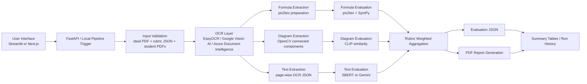
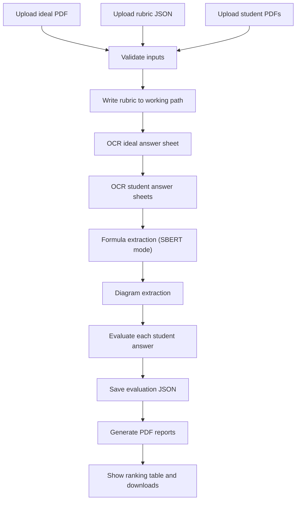

# Automated Subjective Answer Sheet Evaluation System

## Detailed Project Report

## 1. Project Overview

### 1.1 Title
Automated Subjective Answer Sheet Evaluation System

### 1.2 Problem Statement
Traditional answer-sheet evaluation works reasonably well for objective questions, but subjective answer sheets are much harder to assess automatically. In descriptive exams, students do not always write the same words as the ideal answer. They may express the same concept in a different sentence structure, draw diagrams differently, or write mathematical expressions in equivalent but non-identical forms.

Because of this, simple keyword matching is not enough. A practical evaluation system must understand:

- textual meaning
- diagrams and visual structure
- formulas and mathematical equivalence
- printed as well as handwritten answer sheets

This project addresses that problem by building a multimodal evaluation pipeline that can compare student answers with an ideal reference answer sheet using OCR, semantic similarity, diagram comparison, formula-aware checking, and report generation.

### 1.3 Project Goal
The goal of this project is to create a usable academic evaluation platform that can:

- accept an ideal answer sheet, rubric, and student answer sheets
- extract text from answer sheets using suitable OCR backends
- evaluate textual content semantically instead of only matching exact keywords
- separately process diagrams and formulas
- generate per-student scores and feedback
- provide structured outputs such as JSON results, summary tables, and downloadable PDF reports

### 1.4 Why This Project Matters
Manual checking of subjective answer sheets is time-consuming, repetitive, and inconsistent across large batches. This system is designed to reduce manual effort while still preserving a rubric-guided and explainable workflow.

The project is especially useful for:

- faculty members checking descriptive answer sheets
- research projects in educational technology
- experiments in multimodal grading
- building a future product-grade evaluation tool

## 2. Objectives

The major objectives of the project are:

1. Build a pipeline that evaluates descriptive answers beyond exact keyword matching.
2. Support both printed and handwritten answer sheets through multiple OCR paths.
3. Add diagram-aware scoring for visual answers.
4. Add formula-aware scoring for mathematical expressions.
5. Support two evaluation modes:
   - local semantic evaluation using SBERT
   - LLM-based evaluation using Gemini
6. Generate human-readable reports for each student.
7. Provide both a research-facing Streamlit interface and a product-style web interface.

## 3. Scope of the Project

### 3.1 In Scope

- Subjective answer sheet evaluation
- OCR-based text extraction
- Printed sheet OCR using EasyOCR
- Handwritten sheet OCR using Google Vision AI and Azure Document Intelligence
- Semantic text similarity scoring
- Diagram extraction and visual comparison
- Formula extraction and symbolic evaluation
- Rubric-based weighted scoring
- JSON and PDF report generation
- Streamlit interface for research workflow
- FastAPI backend and Next.js frontend for web workflow

### 3.2 Current Assumptions

- One page is currently treated as one question.
- The ideal answer sheet acts as the reference solution.
- Rubric JSON provides per-question weights and maximum marks.
- Diagram regions are expected mainly in lower or distinct visual sections of a page.
- Formula extraction depends on OCR layout heuristics.

### 3.3 Current Limitations

- Very complex handwritten derivations can still be difficult to OCR accurately.
- OCR quality strongly affects downstream scoring quality.
- Formula region detection is heuristic-based, not perfect.
- Diagram extraction currently uses connected-component style visual detection, so unusual layouts can affect accuracy.
- The LLM path is rubric-aware, but the symbolic formula path is primarily integrated in the SBERT workflow.

## 4. End Users

The main users of the system are:

- faculty or examiners
- project supervisors and reviewers
- researchers working on answer-sheet automation
- students or demo audiences observing the evaluation system

## 5. High-Level System Description

The project is a multimodal pipeline built around three major ideas:

1. Extract evidence from answer sheets.
2. Evaluate each evidence type using the most suitable model or method.
3. Combine results according to rubric weights.

The system processes three major answer modalities:

- text
- diagrams
- formulas

It also supports multiple OCR backends:

- EasyOCR
- Google Vision AI
- Azure Document Intelligence

And two evaluation engines:

- SBERT local evaluation
- Gemini LLM evaluation

## 6. Overall Architecture



## 7. Repository Structure

```text
auto_subjective_grader/
|-- backend_api/
|   |-- main.py
|   |-- settings.py
|   |-- content.py
|
|-- src/
|   |-- app.py
|   |-- pipeline_service.py
|   |-- ocr_pipeline.py
|   |-- diagram_extractor.py
|   |-- formula_pipeline.py
|   |-- formula_evaluator.py
|   |-- evaluation_core.py
|   |-- llm_evaluator.py
|   |-- report_generator.py
|
|-- web/
|   |-- app/
|   |-- components/
|   |-- lib/
|   |-- public/
|
|-- data/
|   |-- ideal/
|   |-- students/
|
|-- results/
|   |-- ocr/
|   |-- diagrams/
|   |-- formulas/
|   |-- formula_crops/
|   |-- eval/
|   |-- eval_llm/
|   |-- reports/
|   |-- reports_llm/
|
|-- rubric.json
|-- requirements.txt
|-- requirements.backend.txt
|-- Dockerfile
|-- README.md
```

### 7.1 Purpose of Major Folders

#### `src/`
Contains the core research pipeline and Streamlit app.

#### `backend_api/`
Contains the FastAPI backend used by the product-style web interface.

#### `web/`
Contains the professional web frontend built using Next.js.

#### `data/`
Stores local ideal and student PDFs for development and research testing.

#### `results/`
Stores all generated artifacts such as OCR JSON, diagram crops, formula outputs, evaluation JSON, and PDF reports.

## 8. Input Design

Every run starts with three required inputs:

1. Ideal answer sheet PDF
2. Rubric JSON
3. Student answer sheet PDFs

### 8.1 Ideal Answer Sheet
The ideal answer sheet acts as the ground-truth reference for all comparisons.

### 8.2 Rubric JSON
The rubric defines:

- maximum marks for each question
- text weight
- diagram weight
- formula weight
- whether missing diagrams should be penalized
- whether missing formulas should be penalized

### 8.3 Student Answer Sheets
One or more student PDFs are uploaded and evaluated against the ideal answer sheet.

## 9. Rubric Format

The project uses a JSON rubric. A simplified example is:

```json
{
  "1": {
    "max_marks": 10,
    "text_weight": 0.6,
    "diagram_weight": 0.4,
    "formula_weight": 0.2,
    "penalize_missing_diagram": true,
    "penalize_missing_formula": true
  }
}
```

### 9.1 Meaning of Rubric Fields

- `max_marks`: total marks for that question
- `text_weight`: contribution of textual answer quality
- `diagram_weight`: contribution of diagram quality
- `formula_weight`: contribution of formula correctness
- `penalize_missing_diagram`: whether missing diagram should reduce marks
- `penalize_missing_formula`: whether missing formula should reduce marks

## 10. End-to-End Workflow



### 10.1 Workflow Stages

1. Input validation
2. OCR on ideal answer sheet
3. OCR on each student sheet
4. Formula extraction for SBERT mode
5. Diagram extraction
6. Student-wise evaluation
7. JSON output generation
8. PDF report generation
9. Summary display

## 11. OCR Layer

The OCR layer is implemented in [src/ocr_pipeline.py](../src/ocr_pipeline.py).

Its job is to:

- convert PDFs into images
- run the selected OCR backend
- save page-wise JSON files
- preserve OCR blocks with coordinates and confidence

### 11.1 OCR Output Format

Each page produces a JSON file like:

```json
{
  "page": 1,
  "text": "full extracted text",
  "blocks": [
    {
      "bbox": [[x1, y1], [x2, y2], [x3, y3], [x4, y4]],
      "text": "block text",
      "confidence": 0.92
    }
  ]
}
```

### 11.2 EasyOCR Path

EasyOCR is used for printed or cleaner answer sheets.

Processing steps:

1. Convert PDF pages to images using `pdf2image`.
2. Convert PIL image to NumPy array.
3. Run EasyOCR reader on the page.
4. Save text blocks and full page text as JSON.

Advantages:

- local execution
- no API billing for OCR
- useful for research testing and printed sheets

Limitations:

- not ideal for very messy handwriting

### 11.3 Google Vision AI Path

Google Vision AI is used as a handwriting-aware OCR backend.

Processing steps:

1. Convert PDF pages to images.
2. Compress pages to fit Google Vision request limits.
3. Call `document_text_detection`.
4. Extract paragraph or word blocks with bounding boxes.
5. Save page-wise OCR JSON.

Important implementation points:

- uses Google Application Default Credentials
- supports language hints such as handwriting-oriented English hints
- designed for better handwritten OCR than local EasyOCR in many cases

### 11.4 Azure Document Intelligence Path

Azure Document Intelligence is another handwritten OCR path.

Processing steps:

1. Convert PDF pages into images.
2. Compress pages to fit Azure request limits.
3. Call `prebuilt-read`.
4. Extract line or word content with polygon coordinates.
5. Save OCR results as JSON.

Important requirement:

- needs endpoint and key

### 11.5 Document AI Support

The OCR module also includes a Google Document AI path for processor-based experiments, though the main active handwritten workflows are Google Vision AI and Azure Document Intelligence.

## 12. Diagram Extraction

Diagram extraction is implemented in [src/diagram_extractor.py](../src/diagram_extractor.py).

### 12.1 Why Diagram Extraction Is Needed
Many answer sheets contain figures or circuit-style diagrams that cannot be judged purely through text OCR. If diagrams are mixed into raw OCR text, evaluation becomes noisy and unfair.

The project therefore separates diagrams from text and evaluates them independently.

### 12.2 Method Used
The current system uses connected-component based extraction:

1. Convert page image to grayscale.
2. Threshold near-white background to isolate ink.
3. Apply morphological closing to join nearby strokes.
4. Run `connectedComponentsWithStats`.
5. Filter out small components that are likely just text or noise.
6. Prefer components located in lower visual regions of the page.
7. Compute a union bounding box.
8. Save the cropped diagram as a PNG.

### 12.3 Output
The output is stored as:

```text
results/diagrams/<BaseName>_page<PageNo>_diagram.png
```

### 12.4 Advantages

- lightweight and explainable
- does not require a trained object detector
- works reasonably well for diagram-heavy regions

### 12.5 Limitations

- unusual layouts may confuse the region detector
- diagrams mixed tightly with text can be harder to isolate

## 13. Formula Extraction and Formula OCR

Formula extraction is implemented in [src/formula_pipeline.py](../src/formula_pipeline.py).

### 13.1 Purpose
Mathematical expressions should not be treated as ordinary text because OCR noise can make direct string comparison unreliable. This module isolates formula-like lines and converts them into LaTeX for symbolic analysis.

### 13.2 Processing Steps

1. Read page-wise OCR blocks.
2. Convert each OCR block bounding box into rectangular regions.
3. Group nearby blocks into line candidates.
4. Detect whether a line looks formula-like.
5. Crop the formula region with padding.
6. Run `pix2tex` to convert the crop into LaTeX.
7. Save page-wise formula JSON.

### 13.3 Formula Detection Heuristics
The `_looks_formula_like()` function checks patterns such as:

- math operators like `=`, `+`, `*`, `^`
- fraction-like patterns
- trig or calculus keywords such as `sin`, `cos`, `log`, `lim`, `dx`
- symbolic density
- equation-like alpha-numeric patterns

### 13.4 Formula Output

Each page stores output like:

```json
{
  "page": 1,
  "formula_count": 2,
  "formulas": [
    {
      "index": 1,
      "bbox": [x1, y1, x2, y2],
      "ocr_text": "E = mc^2",
      "latex": "E=mc^2",
      "crop_path": "...",
      "error": ""
    }
  ]
}
```

### 13.5 Crop Storage

Formula image crops are stored under:

```text
results/formula_crops/
```

## 14. Formula Evaluation

Formula comparison is implemented in [src/formula_evaluator.py](../src/formula_evaluator.py).

### 14.1 Why Symbolic Evaluation Is Important
Two formulas may be mathematically equivalent but look different as strings. For example:

- `a/b`
- `\\frac{a}{b}`
- algebraically rearranged equivalent forms

A formula-aware evaluator must check equivalence, not just string similarity.

### 14.2 Processing Logic

1. Normalize LaTeX-like strings.
2. Convert formula text into a SymPy-friendly format when needed.
3. Try parsing with:
   - `sympy.parsing.latex.parse_latex`
   - fallback `parse_expr`
4. Check equivalence using:
   - symbolic simplification
   - equality checks
   - fallback string similarity

### 14.3 Scoring Strategy

Formula scoring returns:

- `1.0` for exact or equivalent formulas
- partial scores for close but imperfect matches
- `0.0` for incorrect or missing required formulas

### 14.4 Feedback
The formula evaluator also returns short explanations such as:

- exact match
- mathematically equivalent
- partially correct
- missing formula
- substantially different formula

## 15. Text and Diagram Evaluation with SBERT

The local evaluation engine is implemented in [src/evaluation_core.py](../src/evaluation_core.py).

### 15.1 Purpose
This is the primary local research evaluation path. It combines:

- semantic text similarity
- diagram similarity
- formula similarity

### 15.2 Text Evaluation

Text evaluation uses:

- Sentence Transformers
- model: `sentence-transformers/all-MiniLM-L6-v2`

The model converts the ideal and student answers into embeddings and computes cosine similarity.

This allows the system to judge whether the student answer is semantically close to the ideal answer, even if exact wording differs.

### 15.3 Text Similarity Mapping

The raw cosine similarity is not used directly. Instead, it is mapped into a scoring fraction using a stricter scoring curve.

Current logic:

- if similarity is less than or equal to `0.6`, score fraction is `0`
- above that, marks increase linearly up to `1.0`

This makes the grading stricter than raw cosine similarity.

### 15.4 Diagram Evaluation

Diagram evaluation uses:

- CLIP model
- model: `openai/clip-vit-base-patch32`

The ideal and student diagram images are embedded and compared using cosine similarity.

### 15.5 Formula Evaluation

Formula evaluation loads extracted formulas page by page and compares them using the symbolic formula evaluator.

### 15.6 Weight Normalization
For each question:

1. text, diagram, and formula weights are read from the rubric
2. weights are normalized
3. each modality contributes proportionally to the final score

### 15.7 Missing Modality Handling

The rubric can specify whether missing diagrams or formulas should be penalized.

If the ideal answer contains a diagram but the student diagram is missing:

- marks can be reduced to zero for that modality
- or the diagram weight can be ignored depending on rubric settings

The same logic applies to formulas.

### 15.8 Question Result
For each question, the system returns:

- question id
- text similarity
- diagram similarity
- formula similarity
- score
- max marks
- feedback

### 15.9 Student Result
For each student, the system returns:

- student base name
- total score
- total maximum score
- percentage
- list of per-question results

## 16. Gemini LLM Evaluation Path

The LLM evaluation engine is implemented in [src/llm_evaluator.py](../src/llm_evaluator.py).

### 16.1 Purpose
The Gemini path provides rubric-aware LLM grading as an alternative evaluation mode.

### 16.2 Environment Requirement

It requires:

- `GEMINI_API_KEY`

The evaluator loads `.env` values if present and then initializes the Gemini model.

### 16.3 Model Used

- `gemini-2.5-flash`

### 16.4 Prompt Strategy
For each question, the evaluator builds a prompt containing:

- question id
- rubric JSON
- ideal answer text
- student answer text
- text and diagram maximum marks
- information about whether ideal and student diagrams are available

If diagrams exist, the evaluator sends:

- ideal diagram image
- student diagram image

The model is instructed to return strict JSON with:

- `text_score`
- `diagram_score`
- `score`
- `max_marks`
- `feedback`

### 16.5 Safety Handling
If Gemini fails or returns invalid output:

- the system falls back to zero score for that question
- error details are written into feedback

### 16.6 Current Role of Gemini Path
The Gemini mode is useful when:

- a rubric-aware LLM perspective is needed
- a semantic grading path beyond local embeddings is required
- hosted evaluation needs an API-driven scoring engine

## 17. Pipeline Orchestration

Pipeline orchestration is implemented in [src/pipeline_service.py](../src/pipeline_service.py).

### 17.1 Main Responsibility
This module coordinates the full run:

- write rubric JSON
- configure OCR
- configure diagram extraction
- configure formula extraction
- select evaluator
- generate reports
- publish progress callbacks

### 17.2 Engine-Dependent Flow

If engine is `SBERT`:

- OCR runs
- formula extraction runs
- diagram extraction runs
- SBERT evaluator runs
- reports are generated in `results/reports`

If engine is `LLM`:

- OCR runs
- diagram extraction runs
- Gemini evaluator runs
- reports are generated in `results/reports_llm`

### 17.3 Progress Tracking

The pipeline publishes progress messages such as:

- Running OCR on ideal answer sheet
- Extracting formulas
- Extracting diagrams
- Evaluating student
- Generating report

This powers the live workflow tracker in the UI.

## 18. Report Generation

PDF report generation is implemented in [src/report_generator.py](../src/report_generator.py).

### 18.1 Purpose
To convert evaluation JSON results into faculty-friendly downloadable PDF reports.

### 18.2 Report Contents

Each report contains:

- student name
- total score
- percentage
- per-question score
- text similarity
- diagram similarity
- formula similarity
- feedback

### 18.3 PDF Tool Used

- `fpdf2`

## 19. FastAPI Backend

The backend is implemented in [backend_api/main.py](../backend_api/main.py).

### 19.1 Role of Backend
The FastAPI backend acts as the bridge between the web interface and the evaluation pipeline.

It handles:

- file uploads
- job creation
- synchronous evaluation
- run history
- report downloads
- runtime configuration
- documentation/team/resource APIs

### 19.2 Core Backend Endpoints

#### Health Endpoints

- `GET /`
- `GET /healthz`
- `GET /api/health`

#### Informational Endpoints

- `GET /api/team`
- `GET /api/resources`
- `GET /api/documentation`
- `GET /api/runtime-config`
- `GET /api/research-paper`

#### Job and Run Endpoints

- `GET /api/jobs`
- `GET /api/jobs/{run_id}`
- `GET /api/runs/{run_id}`
- `GET /api/runs/{run_id}/reports/{report_name}`
- `POST /api/jobs`
- `POST /api/evaluate`

### 19.3 Job Modes

The backend supports two styles:

1. Background job mode through `/api/jobs`
2. Synchronous full-run evaluation through `/api/evaluate`

The production architecture intentionally favors the synchronous path for hosted deployment stability.

### 19.4 Job Metadata

For each run, metadata such as the following is stored:

- run id
- status
- engine
- OCR backend
- student count
- created time
- start time
- completion time
- current step
- total steps
- progress percent
- events timeline
- error message
- report directory
- evaluation directory
- summary rows

### 19.5 Backend Settings

Backend configuration is read by [backend_api/settings.py](../backend_api/settings.py).

It loads:

- allowed origins
- API runs root
- README path
- EasyOCR GPU setting
- Google Vision language hints
- Azure credentials
- Gemini API presence

## 20. Streamlit Interface

The research-facing interface is implemented in [src/app.py](../src/app.py).

### 20.1 Purpose
Streamlit provides a fast experimentation and demonstration interface for:

- uploading files
- running local evaluations
- observing workflow progress
- showing ranking tables
- downloading reports

### 20.2 Main Tabs and Sections

The Streamlit app includes:

- Home
- Evaluate
- Documentation
- Team
- Research Paper
- Resources

### 20.3 Role in the Project

The Streamlit UI is especially useful for:

- BTP demonstrations
- local testing
- pipeline research
- comparing OCR or evaluation settings

## 21. Next.js Web Interface

The product-style web interface is implemented in the `web/` directory.

### 21.1 Frontend Stack

- Next.js 15
- React 19
- TypeScript
- React Markdown

### 21.2 Current Main Web Sections

- Home
- Evaluate
- Documentation
- Team

### 21.3 Web Evaluation Page

The evaluation page is implemented in [web/app/evaluate/page.tsx](../web/app/evaluate/page.tsx).

It supports:

- file uploads
- rubric sample download
- evaluation engine selection
- OCR backend selection
- live workflow tracking
- recent run history
- summary tables
- report downloads

### 21.4 Documentation Page

The documentation page is implemented in [web/app/documentation/page.tsx](../web/app/documentation/page.tsx).

It provides a clean report-style view for methodology, workflow, tools, and outputs.

### 21.5 API Base Handling

API URL handling is implemented in [web/lib/api.ts](../web/lib/api.ts).

Important behavior:

- local development uses localhost API URLs when environment variables are set
- production uses the configured cloud backend URL

## 22. Results and Output Directories

The project stores outputs in structured folders:

### 22.1 OCR Outputs

```text
results/ocr/
```

Stores page-wise OCR JSON.

### 22.2 Diagram Outputs

```text
results/diagrams/
```

Stores cropped diagram images.

### 22.3 Formula Outputs

```text
results/formulas/
```

Stores page-wise formula JSON.

### 22.4 Formula Crop Outputs

```text
results/formula_crops/
```

Stores formula crop images used by pix2tex.

### 22.5 Evaluation Outputs

```text
results/eval/
results/eval_llm/
```

Stores per-student evaluation JSON for SBERT and Gemini modes.

### 22.6 Report Outputs

```text
results/reports/
results/reports_llm/
```

Stores PDF reports for SBERT and Gemini modes.

## 23. Deployment Architecture

### 23.1 Current Production Direction

The repository currently documents and supports:

- Next.js frontend on Vercel
- FastAPI backend on Google Cloud Run

Deployment notes are documented in [DEPLOY_VERCEL_CLOUD_RUN.md](../DEPLOY_VERCEL_CLOUD_RUN.md).

### 23.2 Why This Split Is Used

- Vercel is a strong choice for Next.js frontend hosting
- Cloud Run supports a containerized Python backend
- large evaluation workloads fit better in a backend service than in static web hosting

### 23.3 Docker Backend

The backend image is defined in [Dockerfile](../Dockerfile).

Important points:

- base image: `python:3.10-slim`
- installs system dependencies like Poppler and OpenCV runtime libraries
- installs backend-only Python requirements
- exposes port `8001`
- starts FastAPI through `start-backend.sh`

### 23.4 Backend Startup Script

The startup script is [start-backend.sh](../start-backend.sh).

It:

- reads `PORT`
- starts `uvicorn`
- binds to `0.0.0.0`
- serves `backend_api.main:app`

### 23.5 GitHub Actions

The repository also contains an Azure Container Registry build workflow:

- [.github/workflows/backend-acr.yml](../.github/workflows/backend-acr.yml)

This builds and pushes the backend container image to ACR using GitHub Actions.

## 24. Environment Variables

The current deployment example is provided in [.env.production.example](../.env.production.example).

### 24.1 Common Backend Variables

- `ALLOWED_ORIGINS`
- `API_RUNS_ROOT`
- `POPPLER_PATH`
- `EASYOCR_USE_GPU`
- `GEMINI_API_KEY`
- `AZURE_DOCUMENT_INTELLIGENCE_ENDPOINT`
- `AZURE_DOCUMENT_INTELLIGENCE_KEY`

### 24.2 Google Vision Requirements

Google Vision uses:

- Google Application Default Credentials

This usually means:

- local login using `gcloud auth application-default login`
- or deployment with a service account that has Vision API access

### 24.3 Frontend Variables

For local or deployment use, the frontend can rely on:

- `NEXT_PUBLIC_API_BASE_URL`
- `BACKEND_API_BASE_URL`

## 25. Local Execution Commands

### 25.1 Streamlit

```powershell
.venv\Scripts\python.exe -m streamlit run src\app.py
```

### 25.2 FastAPI Backend

```powershell
.venv\Scripts\python.exe -m uvicorn backend_api.main:app --reload --port 8001
```

### 25.3 Next.js Frontend

```powershell
cd web
npm install
npm run dev
```

### 25.4 Helper Scripts

The repository also includes helper batch files:

- `run_all_local.cmd`
- `run_api_8001.cmd`
- `run_streamlit_8502.cmd`
- `run_web_3100.cmd`

## 26. Tools and Libraries Used

Below is the main toolset used in the project, along with their role and reference links.

| Layer | Tool / Library | Purpose | Link |
|---|---|---|---|
| Language | Python | Core pipeline, backend, OCR, evaluation | [python.org](https://www.python.org/) |
| Research UI | Streamlit | Local testing and research dashboard | [streamlit.io](https://streamlit.io/) |
| Backend API | FastAPI | Uploads, runs, reports, API routes | [fastapi.tiangolo.com](https://fastapi.tiangolo.com/) |
| API Server | Uvicorn | ASGI server for FastAPI | [uvicorn.org](https://www.uvicorn.org/) |
| Web Frontend | Next.js | Product-style web interface | [nextjs.org](https://nextjs.org/) |
| Frontend UI | React | Web component layer | [react.dev](https://react.dev/) |
| OCR | EasyOCR | Printed and clean-sheet OCR | [GitHub](https://github.com/JaidedAI/EasyOCR) |
| OCR | Google Vision AI | Handwritten OCR and cloud text extraction | [Google Cloud Vision](https://cloud.google.com/vision) |
| OCR | Azure Document Intelligence | Handwritten OCR alternative | [Azure Document Intelligence](https://azure.microsoft.com/en-us/products/ai-services/ai-document-intelligence) |
| PDF Processing | pdf2image | Convert PDF pages into images | [GitHub](https://github.com/Belval/pdf2image) |
| Image Processing | OpenCV | Diagram extraction and image operations | [opencv.org](https://opencv.org/) |
| Image Processing | Pillow | Image loading and conversions | [python-pillow.org](https://python-pillow.org/) |
| Semantic Scoring | Sentence Transformers | Text similarity using MiniLM | [sbert.net](https://www.sbert.net/) |
| Visual Scoring | CLIP | Diagram image similarity | [GitHub](https://github.com/openai/CLIP) |
| Formula OCR | pix2tex | Equation image to LaTeX | [GitHub](https://github.com/lukas-blecher/LaTeX-OCR) |
| Symbolic Math | SymPy | Formula parsing and equivalence | [sympy.org](https://www.sympy.org/) |
| LLM Scoring | Gemini 2.5 Flash | Rubric-aware LLM evaluation | [Gemini API Docs](https://ai.google.dev/gemini-api/docs) |
| PDF Reports | FPDF2 | Student report generation | [FPDF2 Docs](https://py-pdf.github.io/fpdf2/) |
| Containerization | Docker | Backend deployment image | [docker.com](https://www.docker.com/) |
| Hosting | Vercel | Next.js deployment | [vercel.com](https://vercel.com/) |
| Hosting | Google Cloud Run | Containerized backend deployment | [cloud.google.com/run](https://cloud.google.com/run) |
| CI/CD | GitHub Actions | Build and push automation | [GitHub Actions](https://docs.github.com/en/actions) |

## 27. Sample Data Flow

To understand the system practically, one run behaves like this:

1. Upload `Ideal Answer Sheet.pdf`
2. Upload `rubric.json`
3. Upload one or more student PDFs
4. Choose `SBERT` or `Gemini`
5. Choose OCR backend:
   - EasyOCR
   - Google Vision AI
   - Azure Document Intelligence
6. Run evaluation
7. OCR JSON is created
8. Diagram and formula outputs are created
9. Student answers are compared page by page
10. Weighted scores are calculated
11. Evaluation JSON and PDF reports are generated
12. Final summary table is shown

## 28. Current Strengths of the Project

- Multimodal design instead of plain OCR-only grading
- Supports both local and cloud evaluation paths
- Includes handwritten OCR support
- Separates text, diagram, and formula handling
- Uses symbolic math comparison for formulas
- Produces downloadable PDF reports
- Provides both research and product-style interfaces

## 29. Current Challenges

- OCR quality remains the biggest bottleneck for complex handwritten content
- Page-to-question mapping is still simplified as one page per question
- Diagram extraction is heuristic-based
- Formula region detection can miss edge cases
- Large hosted runs need careful deployment tuning

## 30. Future Enhancements

Recommended future improvements include:

1. Better question segmentation beyond one-page-one-question assumption
2. Stronger handwritten formula recognition
3. Diagram object detection instead of only connected components
4. Better dashboard analytics and charts
5. Cloud storage for long-term report persistence
6. Human-in-the-loop override and review mode
7. Multi-rubric support for different courses
8. Better benchmarking on large answer-sheet datasets

## 31. Conclusion

The Automated Subjective Answer Sheet Evaluation System is a research-driven, multimodal answer-sheet evaluation platform designed to handle the real complexity of descriptive academic assessment. Instead of relying only on exact keywords, it combines OCR, semantic similarity, diagram analysis, formula parsing, symbolic math evaluation, rubric-based weighting, and report generation into one connected workflow.

This makes the project much more realistic and extensible than a simple text-matching prototype. It already demonstrates a strong foundation for an academic BTP project and also forms the base for a future product-grade evaluation platform.

## 32. Quick Reference

### Core Files

- [src/ocr_pipeline.py](../src/ocr_pipeline.py)
- [src/diagram_extractor.py](../src/diagram_extractor.py)
- [src/formula_pipeline.py](../src/formula_pipeline.py)
- [src/formula_evaluator.py](../src/formula_evaluator.py)
- [src/evaluation_core.py](../src/evaluation_core.py)
- [src/llm_evaluator.py](../src/llm_evaluator.py)
- [src/pipeline_service.py](../src/pipeline_service.py)
- [src/report_generator.py](../src/report_generator.py)
- [src/app.py](../src/app.py)
- [backend_api/main.py](../backend_api/main.py)
- [web/app/evaluate/page.tsx](../web/app/evaluate/page.tsx)

### Key Config Files

- [rubric.json](../rubric.json)
- [requirements.txt](../requirements.txt)
- [requirements.backend.txt](../requirements.backend.txt)
- [Dockerfile](../Dockerfile)
- [.env.production.example](../.env.production.example)

## 33. Note for Future Report Conversion

This document is intentionally written in a structured report style so it can later be converted into:

- a formal project report
- a project synopsis
- a documentation chapter
- a research paper draft

You can now reuse this file as the base document for your guide, internal documentation, viva explanation, or final project report.
